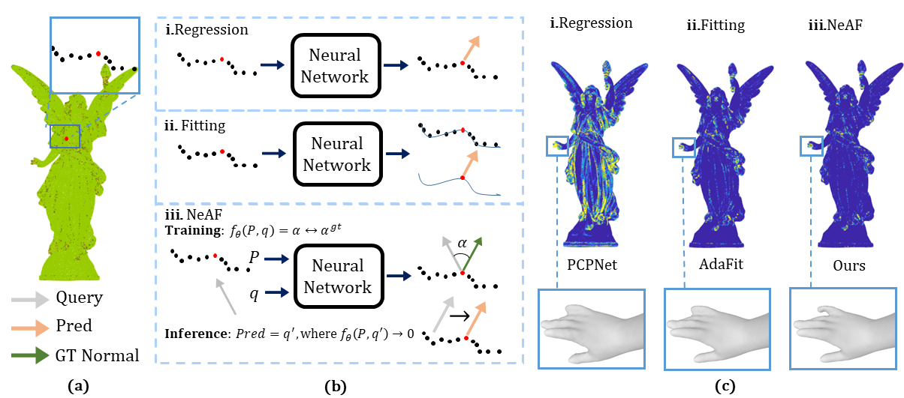

<p align="center">

  <h1 align="center">NeAF: Learning Neural Angle Fields for Point Normal Estimation (AAAI 2023) </h1>
  <p align="center">
     <a><strong>Shujuan Li*</strong></a>
    ·
    <a href="https://junshengzhou.github.io/"><strong>Junsheng Zhou*</strong></a>
    ·
    <a href="https://mabaorui.github.io/"><strong>Baorui Ma*</strong></a>
    ·
    <a href="https://yushen-liu.github.io/"><strong>Yu-Shen Liu</strong></a>
    ·
    <a href="https://h312h.github.io/"><strong>Zhizhong Han</strong></a>

  </p>

  <h3 align="center"><a href="https://lisj575.github.io/NeAF/">Paper</a> | <a href="https://lisj575.github.io/NeAF/">Project Page</a></h3>
  <div align="center"></div>
</p>

<p align="center">
  
</p>

## Requirements
- Install python dependencies:
```bash
conda create -n NeAF python=3.7.11
conda activate NeAF
pip install torch==1.10.0+cu111 -f https://download.pytorch.org/whl/torch_stable.html
pip install tensorboardX scipy scikit-learn
```


## Data preparation
Please download PCPNet dataset at: <http://geometry.cs.ucl.ac.uk/projects/2018/pcpnet/>

## Test
To evaluate NeAF, you can simply use the following command:
```python
python run.py --mode test --indir your_dataset_path --name NeAF --test_epoch 900 --need_prediction 1 --checkpoints 5 --coarse_normal_num 10 --gpu 0 1
# Please change 'your_dataset_path' to your own path of the dataset
```

## Train
To train NeAF, you can simply use the following command:
```python
python run.py --mode train --indir PCPNet_dataset_path --name NeAF --nepoch 1000 --lr 0.001 --query_vector_path ./query_vector_5k.xyz --gpu 0 1
 # Please change 'PCPNet_dataset_path' to your own path of the PCPNet dataset
```

## Citation
If you find our code or paper useful, please consider citing

    @inproceedings{li2023NeAF,
      title={NeAF: Learning Neural Angle Fields for Point Normal Estimation},
      author={Li, Shujuan and Zhou, Junsheng and Ma, Baorui and Liu, Yu-Shen and Han, Zhizhong},
      booktitle={Proceedings of the AAAI Conference on Artificial Intelligence},
      year={2023}
    }